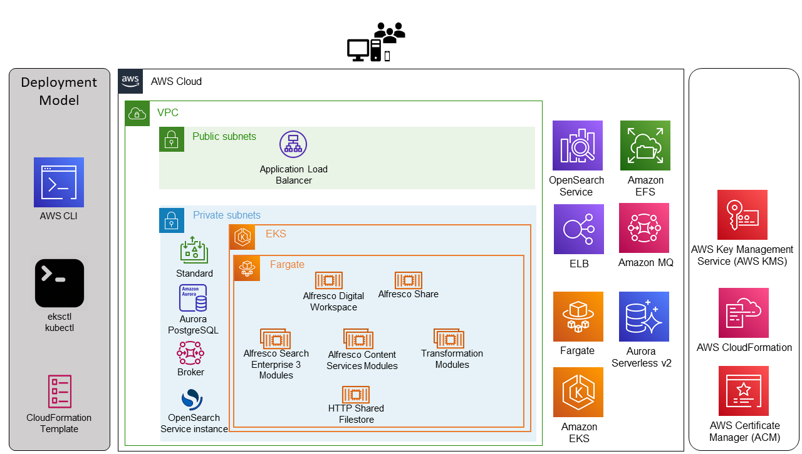

## Using AWS OpenSearch With Serverless Alfresco Content Services

This repository contains files that accompany an AWS Partner Network (APN) blog of the same title.

The blog written in collaboration with [Hyland](https://www.alfresco.com/news/press-releases/hyland-completes-acquisition-alfresco), seeks to demonstrate a deployment of [Alfresco Content Services](https://docs.alfresco.com/content-services/latest/) (ACS) 7.3 on [Amazon Elastic Kubernetes Service (Amazon EKS)](https://aws.amazon.com/eks/) using [AWS Fargate](https://aws.amazon.com/fargate/) as the serverless compute engine. [Amazon OpenSearch Service](https://aws.amazon.com/opensearch-service/) is used to provide Elasticsearch services to [Alfresco Search Enterprise](https://docs.alfresco.com/search-enterprise/latest/) 3.2.

The sample code; software libraries; command line tools; proofs of concept; templates; or other related technology (including any of the foregoing that are provided by our personnel) is provided to you as AWS Content under the AWS Customer Agreement, or the relevant written agreement between you and AWS (whichever applies). You should not use this AWS Content in your production accounts, or on production or other critical data. You are responsible for testing, securing, and optimizing the AWS Content, such as sample code, as appropriate for production grade use based on your specific quality control practices and standards. Deploying AWS Content may incur AWS charges for creating or using AWS chargeable resources, such as running [Fargate](https://aws.amazon.com/fargate/) or using [Amazon Elastic File System (Amazon EFS)](https://aws.amazon.com/efs) storage.
